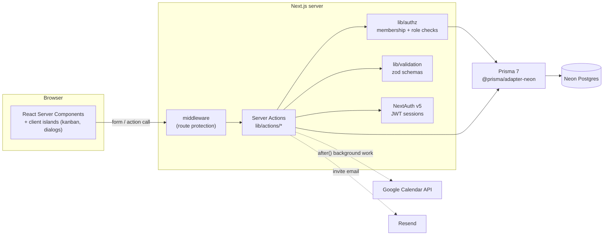

# Karya

Team task management with projects, kanban boards, role-based teams and Google Calendar sync.

[](https://github.com/saumya-st/Karyaa/actions/workflows/ci.yml)
[](LICENSE)
[](https://nextjs.org)

## What it is

Small teams tend to scatter work across chat threads, personal to-do lists and calendars, so nobody has one view of who owns what and when it is due.
Karya puts projects, tasks, comments, invites and notifications in one place, enforces team roles on the server, and pushes assigned tasks straight into each member's Google Calendar.

## Live demo

https://karya-gilt.vercel.app

## Screenshots

<!-- TODO: add screenshots/dashboard.png -->
<!-- TODO: add screenshots/kanban-board.png -->
<!-- TODO: add screenshots/task-detail.png -->
<!-- TODO: add screenshots/analytics.png -->

Images live in `docs/screenshots/`.

## Key features

- **Authentication**: email + password (bcrypt, cost 12) and Google OAuth through NextAuth v5, with stateless JWT sessions.
- **Teams and roles**: every project belongs to a team; members hold `owner`, `admin`, `member` or `guest` roles. Every Server Action re-checks membership and role on the server before touching data.
- **Projects, sections and kanban**: projects start with To Do / In Progress / Done sections; tasks are dragged between sections with optimistic updates, and a list view is available as well.
- **Tasks**: multiple assignees, priority, start/due dates, tracking status, subtasks, comments, small file attachments (stored inline as data URLs), tags, and linking one task into several projects.
- **Invites**: token-based invite links (7-day expiry) and email invites sent through Resend; accepting a link joins the project's team.
- **Notifications and activity log**: assignment, comment and completion events create inbox notifications and a per-task activity history.
- **Analytics dashboard**: totals, completion rate, overdue count, priority breakdown and per-project progress across the user's teams.
- **Ideas board**: team members post ideas, categorise them, vote and comment.
- **Personal notes**: private, colour-coded, pinnable notes per user.
- **Google Calendar sync**: when a Google-connected user is assigned a task, an event is created in their calendar; it is updated when the title, dates or description change and removed when the task is deleted. OAuth tokens are refreshed and persisted automatically.
- **Global search**: command-palette style search across the tasks and projects the user can access.

## Tech stack

| Layer | Technology |
| --- | --- |
| Framework | Next.js 16 (App Router, React Server Components, Server Actions), React 19, TypeScript |
| Styling | Tailwind CSS 4, lucide-react icons, @hello-pangea/dnd for drag-and-drop |
| Auth | NextAuth v5 (Credentials + Google), JWT session strategy, bcryptjs |
| Data | Prisma 7 with `@prisma/adapter-neon` on Neon serverless Postgres |
| Validation | zod schemas for every mutating Server Action |
| Integrations | Google Calendar API (googleapis), Resend (transactional email) |
| Tooling | ESLint 9, Vitest 4 + V8 coverage, GitHub Actions, Docker (multi-stage) |

## Architecture



Request flow for a mutation: the component calls a Server Action; `middleware.ts` has already redirected anonymous users; the action reads the user id from the JWT (`getCurrentUserId`), validates its input with zod, asserts team membership or role with `lib/authz.ts`, then runs Prisma queries. Slow side effects (activity log, notifications, calendar sync) run in `after()` so they do not block the response, and `revalidatePath` refreshes the affected pages.

## Getting started

### Prerequisites

- Node.js 20 or newer and npm
- A [Neon](https://neon.tech) Postgres database (the free tier is enough). The app uses Neon's serverless driver, so a plain local Postgres is not a drop-in replacement.
- Optional: a Google Cloud OAuth client (for Google sign-in and Calendar sync) and a Resend API key (for email invites)

### Setup

```bash
git clone https://github.com/saumya-st/Karyaa.git
cd Karyaa
npm install            # also runs `prisma generate`
cp .env.example .env   # then fill in the values (each one is documented in the file)
npx prisma db push     # creates the tables in your Neon database
npm run dev
```

Open http://localhost:3000, register an account (a personal team is created automatically) and create a project.

`prisma/seed.ts` contains optional demo data (a demo user, team and project); run it with a TypeScript runner such as `npx tsx prisma/seed.ts` after `db push`.

## Scripts

| Script | What it does |
| --- | --- |
| `npm run dev` | Start the development server |
| `npm run build` | `prisma generate` then `next build` (standalone output) |
| `npm start` | Serve the production build |
| `npm run lint` | ESLint (Next.js core-web-vitals + TypeScript rules) |
| `npm run typecheck` | `tsc --noEmit` over the whole project |
| `npm test` | Run the Vitest unit suite once |
| `npm run test:coverage` | Same, with a V8 coverage report for `lib/authz.ts` and `lib/validation.ts` |

## Testing & CI

Unit tests live in `tests/` and run with Vitest:

- `validation.test.ts`: valid and invalid inputs for every zod schema, including the FormData helper.
- `authz.test.ts`: each authorization helper with Prisma mocked through `vi.mock("@/lib/prisma")`, covering member, non-member, wrong-role and missing-resource paths.
- `password.test.ts`: the bcrypt cost-12 hash/compare round trip used by registration and login.

The GitHub Actions workflow (`.github/workflows/ci.yml`) runs on every push and pull request on Node 20: `npm ci`, lint, typecheck, tests and a production build with placeholder environment variables. Nothing connects to a database at build time, so no secrets are needed in CI.

## Docker

A multi-stage `Dockerfile` builds the app with `output: "standalone"` and runs it as a non-root user on port 3000:

```bash
docker build -t karya --build-arg NEXT_PUBLIC_APP_URL=https://your-domain .
docker run -p 3000:3000 --env-file .env karya
```

The image has not yet been built or run by the maintainer (Docker was not available on the development machine), so treat it as a starting point and open an issue if a stage fails.

## Design decisions & trade-offs

**Server Actions instead of a REST layer.** Every mutation is a plain async function in `lib/actions/` called directly from components. This removes a whole class of boilerplate (route handlers, fetch wrappers, request/response typing) and keeps the data access next to the UI that uses it. The trade-off is that the backend is not consumable by other clients; a mobile app or third-party integration would need a separate API. Because actions are still public HTTP endpoints, each one validates its input with zod and performs its own authorization check rather than trusting the caller.

**JWT sessions plus server-side team roles.** Sessions are stateless JWTs, so no session table is read on every request and middleware can run without a database. Roles are not stored in the token; they live on `TeamMember` and are looked up per action in `lib/authz.ts`. That costs one extra indexed query per mutation but means a role change takes effect immediately and a stale token can never grant elevated access. The downside of JWTs is that sign-out cannot invalidate a token server-side before it expires.

**Neon serverless Postgres with the Prisma adapter.** Neon's HTTP/WebSocket driver suits serverless deployments where connection pooling is otherwise a problem, and the Prisma 7 adapter keeps the typed query API. The cost is a dependency on Neon's protocol: swapping in a plain Postgres instance requires changing the adapter.

**bcrypt with cost 12.** Cost 12 takes roughly a quarter of a second per hash on commodity hardware, which is slow enough to make offline brute force expensive but fast enough not to be noticed at login. It is a deliberate middle ground; the value can be raised as hardware improves without re-hashing existing passwords until their next login.

**Background work with `after()`.** Activity logs, notifications and calendar sync run after the response is sent. This keeps interactions fast but means those side effects are best-effort: if the process is terminated early they can be lost, and failures surface only in server logs.

**Tags are global.** Tags are shared across all teams by name rather than scoped per team, which keeps the model simple but means tag names can collide between unrelated teams.

## Future work

- REST or OpenAPI layer over the same service functions, for mobile and integrations
- Rate limiting on registration, login and invite endpoints
- Audit log UI on top of the existing activity records (filter by user, project and action)
- End-to-end tests (Playwright) for the core flows: register, create project, drag a task, invite a member
- Realtime updates (Server-Sent Events or websockets) instead of refresh-on-mutation
- Per-team tags and attachment uploads to object storage

## License

MIT. See [LICENSE](LICENSE).

## Author

**Saumya Tiwari**

- Portfolio: https://saumya-tiwari.vercel.app
- GitHub: [@saumya-st](https://github.com/saumya-st)
- LinkedIn: https://www.linkedin.com/in/saumya-tiwari-22909a330
